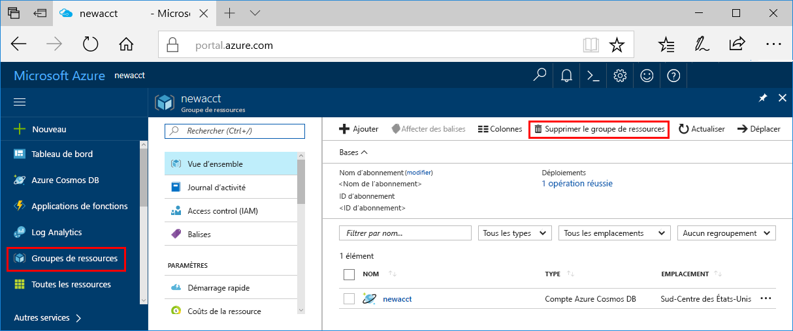

Si vous ne pensez pas continuer à utiliser cette application, supprimez toutes les ressources créées par ce démarrage rapide en procédant de la façon suivante de façon à ne pas exposer de coûts :

>[!NOTE]
>Ces ressources sont utiles si vous suivez les autres didacticiels sur les services Azure Machine Learning maintenant.

1. Dans le portail Azure, sélectionnez **Groupes de ressources** tout à gauche.  
 
   

2. Dans la liste des groupes de ressources, sélectionnez le groupe de ressources que vous avez créé, puis cliquez sur **Supprimer un groupe de ressources**.

3. Tapez le nom du groupe de ressources à supprimer, puis cliquez sur **Supprimer**.

