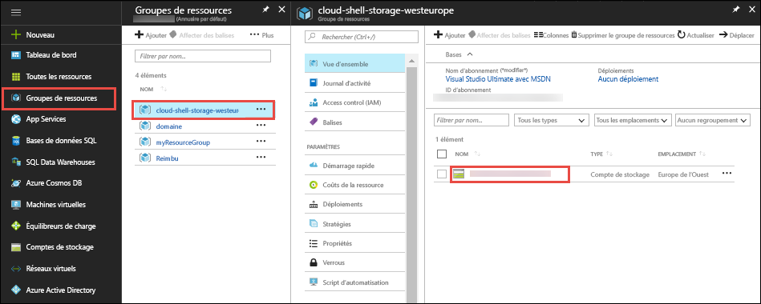
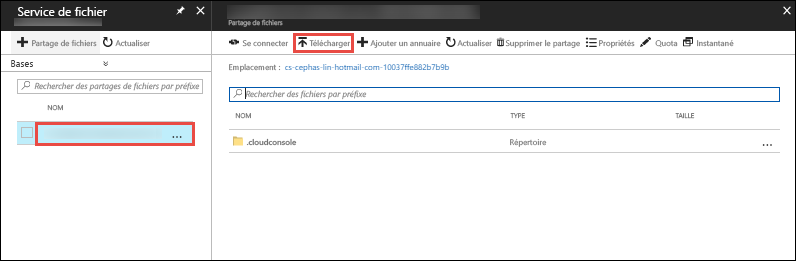

Dans le [portail Azure](https://portal.azure.com), cliquez sur **Groupes de ressources** > **cloud-shell-storage-\<votre_région>** > **\<nom_compte_stockage>**.



Sur la page **Vue d’ensemble** du compte de stockage, sélectionnez **Fichiers**.

Sélectionnez le partage de fichiers généré automatiquement, puis sélectionnez **Télécharger**. Ce partage de fichiers est monté dans Cloud Shell en tant que `clouddrive`.



Cliquez sur le sélecteur de fichiers, sélectionnez votre fichier ZIP, puis cliquez sur **Télécharger**. 

Dans l’interface Cloud Shell, utilisez `ls` pour vérifier que le fichier ZIP téléchargé s’affiche dans le partage `clouddrive` par défaut.

```azurecli-interactive
ls clouddrive
```
