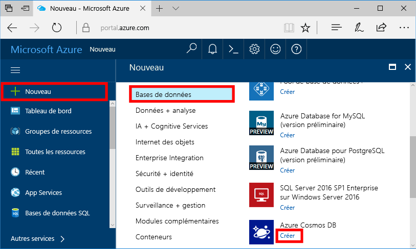
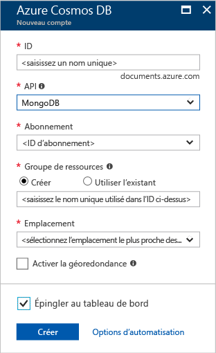
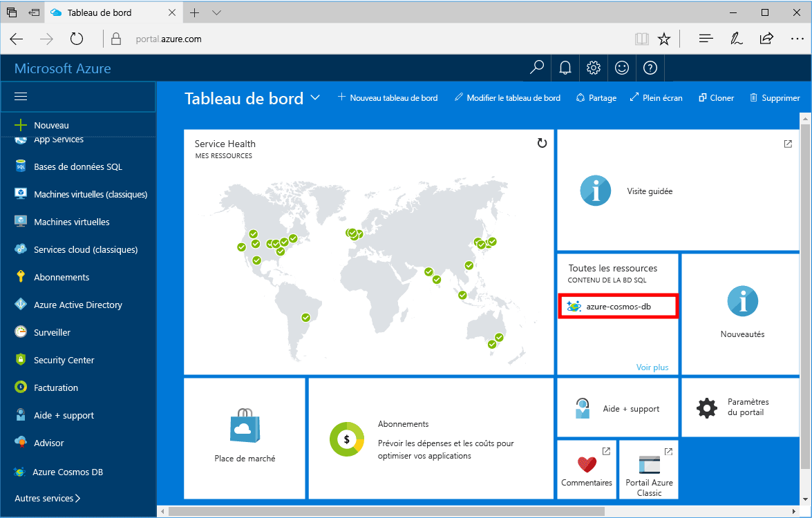

1. Dans une nouvelle fenêtre, connectez-vous au [portail Azure](https://portal.azure.com/).
2. Dans le menu de gauche, cliquez sur **Créer une ressource**, sur **Bases de données**, puis sous **Azure Cosmos DB**, cliquez sur **Créer**.
   
   

3. Dans le panneau **Nouveau compte**, indiquez **MongoDB** comme API et effectuez la configuration souhaitée pour le compte Azure Cosmos DB.
 
    

    * **ID** doit être un nom unique que vous voulez utiliser pour identifier votre compte Azure Cosmos DB. Il ne peut contenir que des lettres minuscules, des nombres, le caractère « - », et doit présenter entre 3 et 50 caractères.
    * **Abonnement** correspond à votre abonnement Azure. Il est rempli automatiquement.
    * **Groupe de ressources** correspond au nom du groupe de ressources pour votre compte Azure Cosmos DB.
    * **Emplacement** correspond à l’emplacement géographique de votre instance Azure Cosmos DB. Choisissez l’emplacement le plus proche de vos utilisateurs.

4. Cliquez sur **Créer** pour créer le compte.
5. Dans la barre d’outils, cliquez sur **Notifications** pour surveiller le processus de déploiement.

    

6.  Lorsque le déploiement est terminé, ouvrez le nouveau compte à partir de la mosaïque Toutes les ressources. 

    
