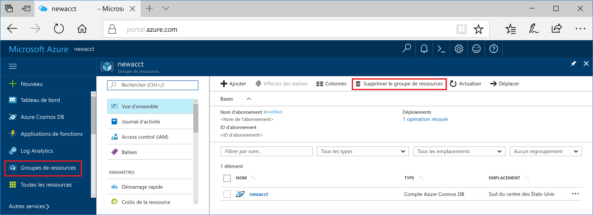

Si vous ne pensez pas continuer à utiliser cette application, supprimez toutes les ressources créées par ce démarrage rapide en procédant de la façon suivante de façon à ne pas exposer de coûts :

1. Dans le portail Azure, sélectionnez **Groupes de ressources** tout à gauche, puis sélectionnez le groupe de ressources que vous avez créé.  

    Si le menu de gauche est réduit, cliquez sur  pour le développer.

   

2. Dans la nouvelle fenêtre, sélectionnez le groupe de ressources, puis cliquez sur **Supprimer le groupe de ressources**.

      

3. Dans la nouvelle fenêtre, saisissez le nom du groupe de ressources à supprimer, puis cliquez sur **Supprimer**.

