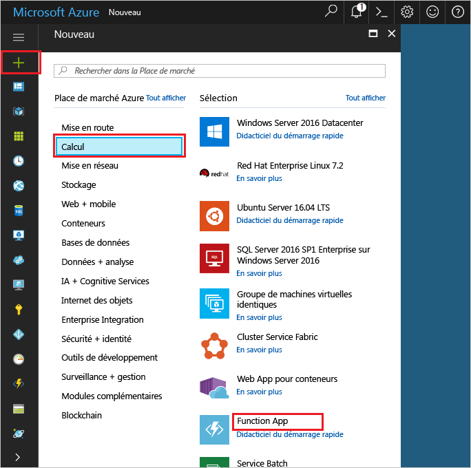
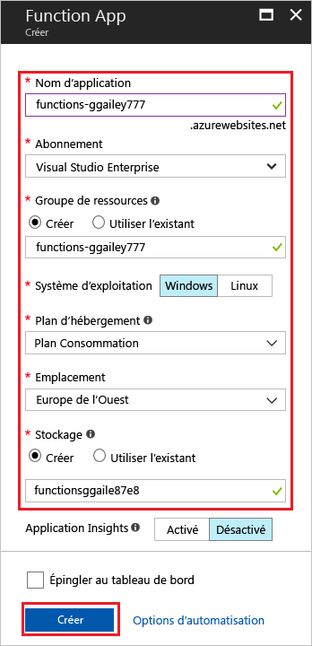
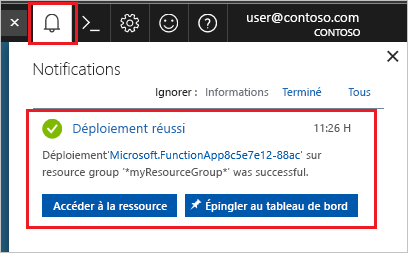

1. Cliquez sur **Créer une ressource** dans le coin supérieur gauche du portail Azure, puis sélectionnez **Calcul** > **Application de fonction**. 

    

2. Utilisez les paramètres d’application de fonction comme indiqué dans le tableau sous l’image.

    

    | Paramètre      | Valeur suggérée  | Description                                        |
    | ------------ |  ------- | -------------------------------------------------- |
    | **Nom de l’application** | Nom globalement unique | Nom qui identifie votre nouvelle Function App. Les caractères valides sont `a-z`, `0-9` et `-`.  | 
    | **Abonnement** | Votre abonnement | Abonnement sous lequel est créée cette nouvelle application de fonction. | 
    | **[Groupe de ressources](../articles/azure-resource-manager/resource-group-overview.md)** |  myResourceGroup | Nom du nouveau groupe de ressources dans lequel créer votre Function App. | 
    | **SE** | Windows | L’hébergement serverless est disponible uniquement avec une exécution sur Windows. Pour l’hébergement sur Linux, consultez [Créer votre première fonction exécutée sur Linux à l’aide d’Azure CLI](../articles/azure-functions/functions-create-first-azure-function-azure-cli-linux.md). |
    | **[Plan d’hébergement](../articles/azure-functions/functions-scale.md)** |   Plan de consommation | Plan d’hébergement qui définit la façon dont les ressources sont allouées à votre Function App. Dans la valeur par défaut **Plan de consommation**, les ressources sont ajoutées dynamiquement comme requis par vos fonctions. Avec cet hébergement [serverless](https://azure.microsoft.com/overview/serverless-computing/), vous payez uniquement pour la durée d’exécution de vos fonctions.   |
    | **Lieu** | Europe de l'Ouest | Choisissez une [région](https://azure.microsoft.com/regions/) près de chez vous ou près d’autres services auxquels ont accès vos fonctions. |
    | **[Compte de stockage](../articles/storage/common/storage-create-storage-account.md#create-a-storage-account)** |  Nom globalement unique |  Nom du nouveau compte de stockage utilisé par votre Function App. Les noms des comptes de stockage doivent comporter entre 3 et 24 caractères, uniquement des lettres minuscules et des chiffres. Vous pouvez également utiliser un compte existant. |

1. Cliquez sur **Créer** pour configurer et déployer la nouvelle Function App. Vous pouvez surveiller l’état du déploiement en cliquant sur l’icône Notification en haut à droite du portail. 

    

    Cliquez sur **Accéder à la ressource** pour accéder à votre nouvelle application de fonction.
