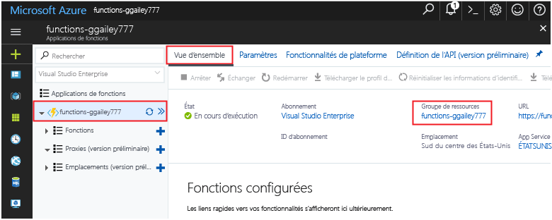

Les autres démarrages rapides de cette collection reposent sur ce démarrage rapide. Si vous envisagez d’utiliser d’autres démarrages rapides, didacticiels ou l’un des services que vous avez créés dans ce démarrage rapide, ne supprimez pas les ressources.

*Ressources* dans Azure fait référence aux applications de fonction, fonctions, comptes de stockage, etc. Elles sont rassemblées en *groupes de ressources*, et vous pouvez supprimer tous les éléments d’un groupe en supprimant le groupe. 

Vous avez créé des ressources pour effectuer ces démarrages rapides. Vous pouvez être facturé pour ces ressources, en fonction de [l’état de votre compte](https://azure.microsoft.com/account/) et de la [tarification du service](https://azure.microsoft.com/pricing/). Si vous n’avez plus besoin des ressources, voici comment les supprimer :

1. Dans le portail Azure, accédez à la page **Groupe de ressources**. 

   Pour accéder à cette page à partir de la page d’application de fonction, sélectionnez l’onglet **Vue d’ensemble**, puis le lien situé sous **Groupe de ressources**.

   

   Pour accéder à la page à partir du tableau de bord, sélectionnez **Groupes de ressources**, puis le groupe de ressources que vous avez utilisé pour ce démarrage rapide.

2. Sur la page **Groupe de ressources**, passez en revue la liste des ressources incluses et vérifiez qu’elles correspondent à celles que vous souhaitez supprimer.
 
3. Sélectionnez **Supprimer le groupe de ressources** et suivez les instructions.

   Cette opération peut prendre quelques minutes. Une fois terminée, une notification s’affiche pendant quelques secondes. Vous pouvez également sélectionner l’icône représentant une cloche en haut de la page pour afficher la notification.
