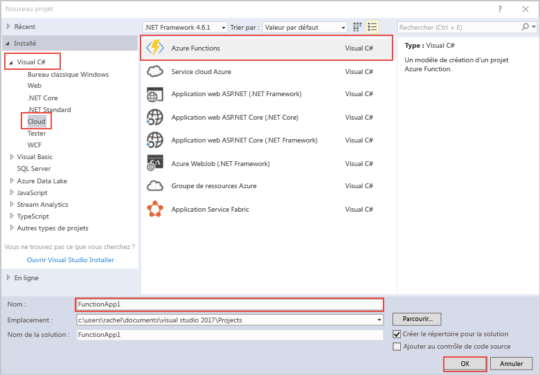
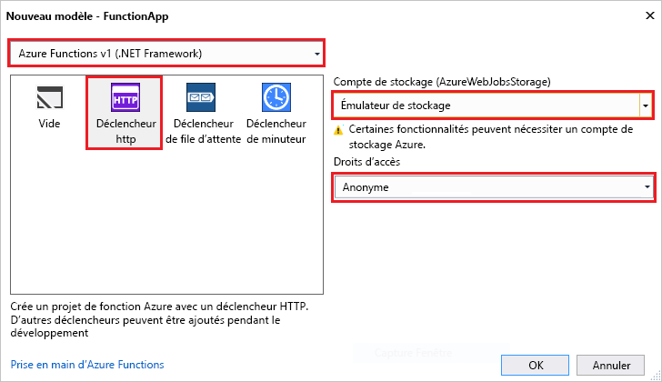

Le modèle de projet Azure Functions dans Visual Studio crée un projet qui peut être publié dans une application de fonctions dans Azure. Une application de fonctions vous permet de regrouper les fonctions dans une unité logique pour la gestion, le déploiement et le partage des ressources.   

1. Dans Visual Studio, sélectionnez **Nouveau** > **Projet** dans le menu **Fichier**. 

2. Dans la boîte de dialogue **Nouveau projet**, sélectionnez **Installé**, développez **Visual C#** > **Cloud**, sélectionnez **Azure Functions**, tapez un **Nom** pour votre projet, puis cliquez sur **OK**. Le nom de l’application de fonctions doit être valide en tant qu’espace de noms C#, afin de ne pas utiliser des traits d’union, des traits de soulignement ou d’autres caractères non alphanumériques. 

     

2. Utilisez les paramètres spécifiés dans le tableau à la suite de l’image.
 
     

    | Paramètre      | Valeur suggérée  | Description                      |
    | ------------ |  ------- |----------------------------------------- |
    | **Version** | Azure Functions v1  (.NET Framework) | Ce paramètre crée un projet de fonction qui utilise le runtime Azure Functions version 1. Le runtime version 2, qui prend en charge .NET Core, est pour l’instant disponible en préversion. Pour plus d’informations, consultez [Guide pratique pour cibler la version du runtime Azure Functions](../articles/azure-functions/functions-versions.md).   | 
    | **Modèle** | Déclencheur HTTP | Ce paramètre crée une fonction déclenchée par une requête HTTP. |
    | **Compte de stockage**  | Émulateur de stockage | Un déclencheur HTTP n’utilise pas la connexion de compte de stockage. Tous les autres types de déclencheurs nécessitent une chaîne de connexion de compte de stockage valide. |
    | **Droits d’accès** | Anonyme | La fonction créée peut être déclenchée par n’importe quel client sans fournir une clé. Ce paramètre d’autorisation facilite le test de votre nouvelle fonction. Pour plus d’informations sur les clés et autorisations, consultez [Clés d’autorisation](../articles/azure-functions/functions-bindings-http-webhook.md#authorization-keys) dans [HTTP et liaisons de webhook](../articles/azure-functions/functions-bindings-http-webhook.md). |         
3. Cliquez sur **OK** pour créer le projet de fonction et la fonction déclenchée HTTP. 

