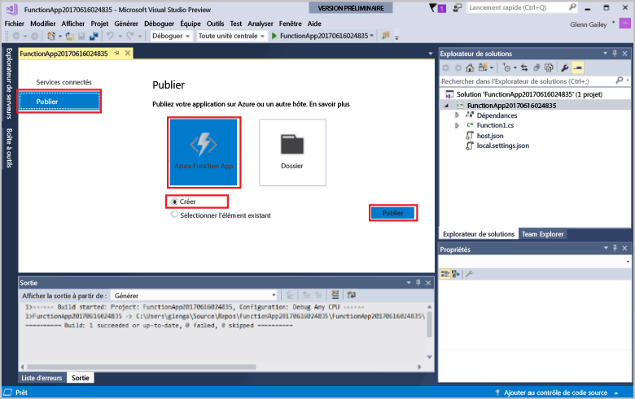
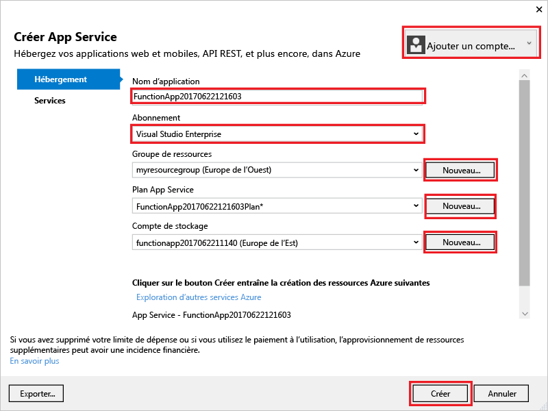
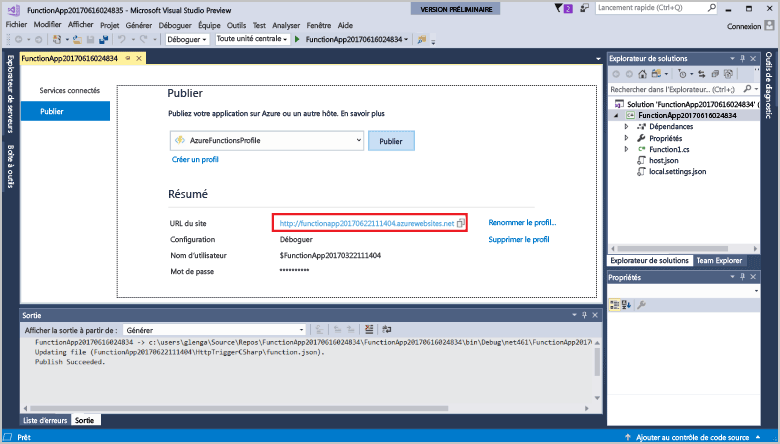

1. Dans **l’Explorateur de solutions**, cliquez avec le bouton droit sur le projet, puis sélectionnez **Publier**. Choisissez **Créer**, puis **Publier**. 

    

2. Si vous n’avez pas déjà connecté Visual Studio à votre compte Azure, sélectionnez **Ajouter un compte...**.  

3. Dans la boîte de dialogue **Créer App Service**, utilisez les paramètres **Hébergement** comme spécifiés dans le tableau suivant : 

    

    | Paramètre      | Valeur suggérée  | Description                                |
    | ------------ |  ------- | -------------------------------------------------- |
    | **Nom de l’application** | Nom globalement unique | Nom qui identifie uniquement votre nouvelle application de fonction. |
    | **Abonnement** | Choisissez votre abonnement | Sélectionnez l’abonnement Azure à utiliser. |
    | **[Groupe de ressources](../articles/azure-resource-manager/resource-group-overview.md)** | myResourceGroup |  Nom du groupe de ressources où créer votre application de fonction. Choisissez **Nouveau** pour créer un groupe de ressources.|
    | **[Plan App Service](../articles/azure-functions/functions-scale.md)** | Plan de consommation | Veillez à choisir **Consommation** sous **Taille** après avoir cliqué sur **Nouveau** pour créer un plan. Choisissez également un **Emplacement** dans une [région](https://azure.microsoft.com/regions/) près de chez vous ou près d’autres services auxquels ont accès vos fonctions.  |

    >[!NOTE]
    >Un compte de stockage Azure est obligatoire par le runtime Functions. Pour cette raison, un autre compte de stockage Azure est créé pour vous quand vous créez une application de fonctions.

4. Cliquez sur **Créer** pour créer une application de fonctions et les ressources associées dans Azure avec ces paramètres et déployer votre code de projet de fonction. 

5. Une fois le déploiement terminé, notez la valeur **URL du site**, qui est l’adresse de votre application de fonctions dans Azure.

    
